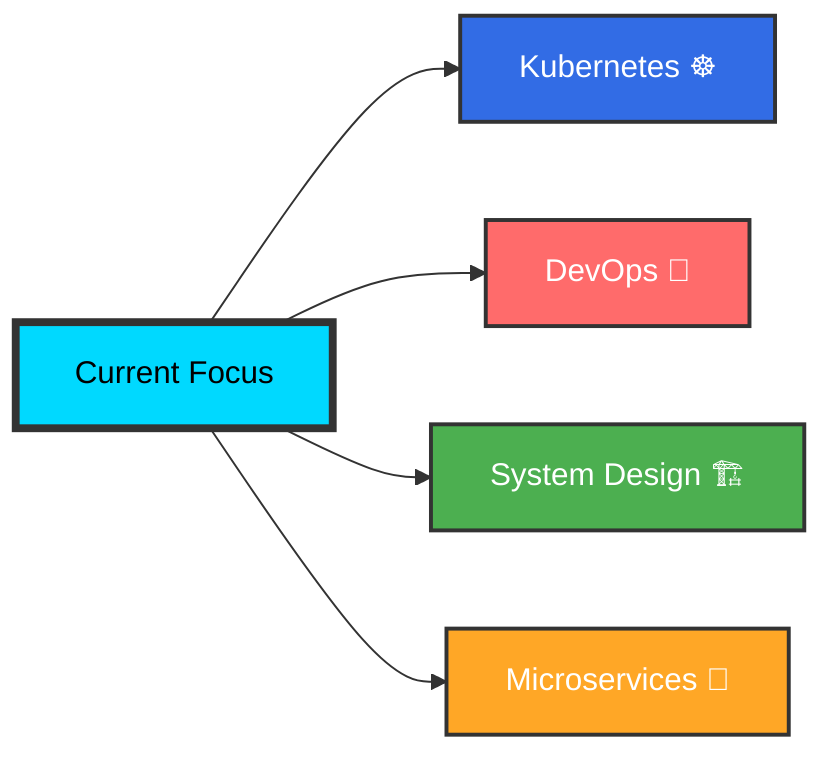

<div align="center">
  
# 👋 Hey there! I'm Amit Thakur


### 🎯 Software Engineer | Building Scalable Web Applications | DevOps Explorer

[](https://linkedin.com/in/amit-thakur)
[](mailto:amitthakur10sep@gmail.com)
[](https://leetcode.com/u/atulthakur10sep/)
[](https://geeksforgeeks.org/amit-thakur)


</div>

---

## 🚀 About Me

```javascript
const amit = {
    location: "Ludhiana, Punjab, India 📍",
    currentRole: "Software Developer Intern @ Helios Tech Labs",
    education: "MCA @ Graphic Era Hill University (8.39 CGPA)",
    currentlyLearning: ["Kubernetes", "DevOps", "System Design"],
    passions: ["Building scalable applications", "Problem solving", "Clean code"],
    funFact: "I debug with console.log and I'm proud of it! 😄"
};
```


## 💻 Tech Stack

<div align="center">

### 🎨 Frontend Development


### ⚙️ Backend Development


### 🗄️ Databases & ORMs


### 🛠️ DevOps & Tools


### 🧩 Other Technologies


</div>


## 🏆 Featured Projects

<div align="center">

### 🎯 Taskedo Portal
[](https://github.com/amit101999/taskedo-portal)
[](https://promanage.duckdns.org)

**Role-based Task Management Platform with Real-time Updates**

`React` `TypeScript` `Redux` `Prisma` `PostgreSQL` `Express` `Socket.io` `Docker` `AWS EC2` `CI/CD`

- 🔐 JWT Authentication & Role-Based Access Control (RBAC)
- 📊 Admin Dashboard with Analytics & User Management
- ⚡ Real-time Notifications using Socket.io
- 📧 Email + Live Notification System
- 🚀 CI/CD Pipeline with GitHub Actions
- 🐳 Dockerized Deployment on AWS EC2

---

### 💼 DreamJobs Portal
[](https://github.com/amit101999/dreamjobs-portal)
[](https://job-portal-frontend-tau-orpin.vercel.app)

**AI-Powered Job Portal with Smart Recommendations**

`React` `Redux` `Node.js` `MongoDB` `Gemini AI` `Cloudinary` `Tailwind CSS`

- 🤖 AI-Generated Resume Summaries using Gemini AI
- 🎯 Smart Job Recommendations
- 🔍 Advanced Multi-Criteria Job Search
- 👥 Separate Admin & User Panels
- 📁 Secure Media Handling with Cloudinary
- 📈 Applicant Tracking System

</div>


## 💼 Professional Experience

<div align="center">

### 🚀 Helios Tech Labs - Software Developer Intern

 **Key Achievements:**

</div>

- 🏪 Built a comprehensive **POS & Inventory Management System** using MERN stack
- 🔗 Integrated with **Zoho Inventory & Foodics API** for multi-outlet automation
- ⚡ Optimized RESTful APIs with caching & async handling, **reducing response time by 35%**
- 🔄 Automated cron jobs for POS-inventory synchronization
- 🔔 Enhanced notification polling mechanism with **JWT & RBAC**
- ☁️ Deployed on **Zoho Catalyst AppSail**


## 📊 GitHub Stats

<div align="center">
  


</div>


## 🎯 Coding Profiles

<div align="center">

| Platform | Profile | Stats |
|----------|---------|-------|
| 🟢 **GeeksforGeeks** | [amit-thakur](https://geeksforgeeks.org/amit-thakur) |  |
| 🟠 **LeetCode** | [atulthakur10sep](https://leetcode.com/u/atulthakur10sep/) |  |


</div>


## 🎓 Education

<div align="center">

| 🎓 Degree | 🏛️ Institution | 📅 Year | 📊 CGPA/Grade |
|-----------|---------------|---------|---------------|
| **Master of Computer Application** | Graphic Era Hill University | 2023 - 2025 | 8.39 CGPA |
| **Bachelor of Computer Application** | IGNOU | 2020 - 2023 | Completed |

</div>


## 🌱 Currently Learning

<div align="center">


```mermaid
graph LR
    A[Current Focus] --> B[Kubernetes ☸️]
    A --> C[DevOps 🔧]
    A --> D[System Design 🏗️]
    A --> E[Microservices 🔮]
    
    style A fill:#00D9FF,stroke:#333,stroke-width:4px,color:#000
    style B fill:#326CE5,stroke:#333,stroke-width:2px,color:#fff
    style C fill:#FF6B6B,stroke:#333,stroke-width:2px,color:#fff
    style D fill:#4CAF50,stroke:#333,stroke-width:2px,color:#fff
    style E fill:#FFA726,stroke:#333,stroke-width:2px,color:#fff
```

</div>


## 📫 Let's Connect!

<div align="center">


### 💌 Feel free to reach out for collaborations, opportunities, or just a tech chat!

[](https://linkedin.com/in/amit-thakur)
[](mailto:amitthakur10sep@gmail.com)
[](#)

</div>


<div align="center">

### 🐍 Watch my contribution graph get eaten by the snake!


---

### ⭐ From [amit101999](https://github.com/amit101999) | 💙 Thanks for visiting!


**"Code is like humor. When you have to explain it, it's bad!"** 😄

</div>